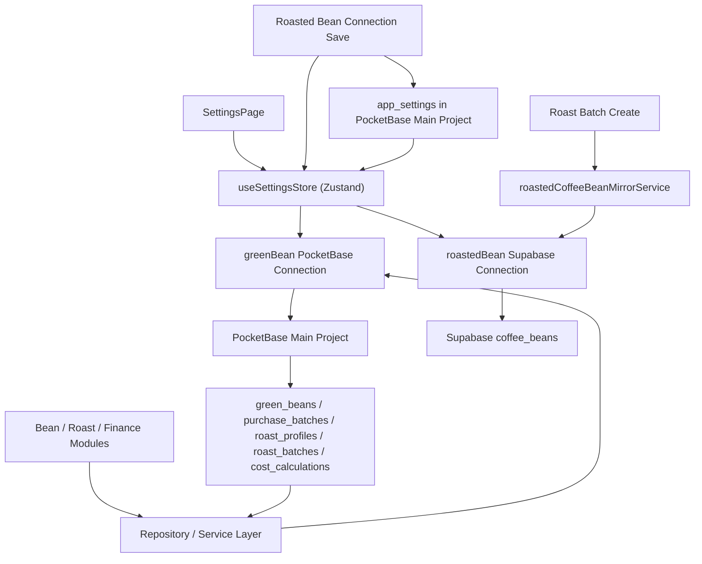

# 设置模块与熟豆 Supabase 镜像架构

## 设计说明

- 生豆、烘焙计划、烘焙历史、成本核算的主业务数据统一走 PocketBase 主库。
- 熟豆 Supabase 只保留两条链路：设置页配置/探活，以及烘焙历史创建成功后的熟豆镜像写入。
- 熟豆连接配置在单次前端运行时内会保留在 Zustand / runtime memory 中，避免用户在页面间来回切换时重复回拉与重复探活；刷新页面或重新启动 PWA 后会重新执行一次校验。
- 设置页会把熟豆 Supabase `Project URL` / `Publishable Key` 同步到主库 `app_settings`，用于多端共享；不会从熟豆 Supabase 回拉业务数据。
- 页面层不直接依赖 Supabase SDK，熟豆镜像与探活统一通过 REST 客户端完成。
