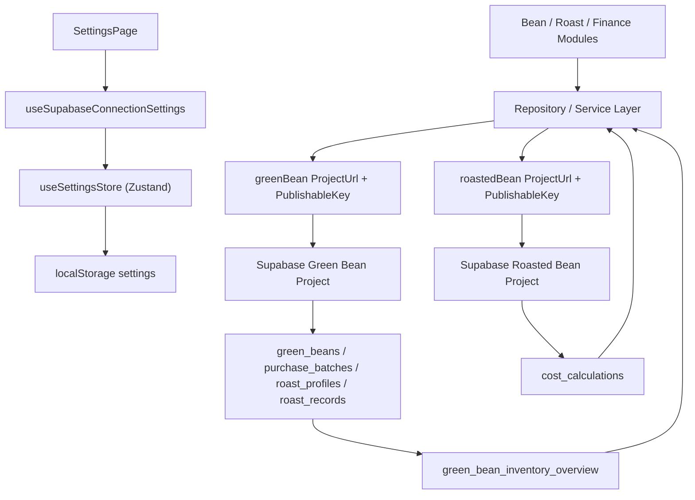

# 设置模块与双 Supabase 连接架构

## 设计说明

- 设置模块当前只负责采集和保存前端可公开使用的连接配置。
- 生豆库和熟豆库拆成两个 Supabase 项目，便于后续按领域拆权限、拆 RLS、拆财务边界。
- 页面层不直接依赖 Supabase SDK，仍然通过 `Service -> Repository` 接入。
- 熟豆连接配置只做单向写入：设置页在失焦后把熟豆 `Project URL` / `Publishable Key` 写入主库的设置记录，不会从熟豆库回拉任何连接信息。
- 生豆列表未来推荐直接读 `green_bean_inventory_overview`，避免前端重复做成本和库存聚合。
- 成本模块优先将 `cost_calculations` 写入熟豆库；如果熟豆库未配置，会自动降级写入生豆库，保证当前阶段仍可测试。
